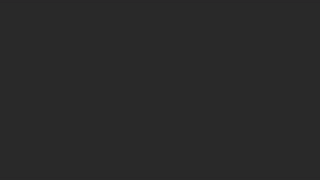

# Animated text generator based on the Bevy engine



## __Prerequisite__

`FiraCode-Medium.ttf` must be in the `assets/fonts` directory, otherwise the build will fail.

[https://github.com/tonsky/FiraCode](https://github.com/tonsky/FiraCode)

[https://fonts.google.com/specimen/Fira+Code](https://fonts.google.com/specimen/Fira+Code)

You can of course use a different font file as well. In that case you will have to change the source code in the `setup` function in `src/main.rs` accordingly.

## Features

* color gradients from the [colorgrad](https://crates.io/crates/colorgrad) crate
* procedural texturing using [noise](https://crates.io/crates/noise)
* video capturing using [bevy_capture](https://crates.io/crates/bevy_capture)
* command line interface using [clap](https://crates.io/crates/clap)
* last but not least text mesh generation using [meshtext](https://crates.io/crates/meshtext)

## Example

The following command will generate an h264 encoded `.mp4` file displaying "Hello Bevy!":

```sh
cargo run --release -- --text "Hello Bevy!" --output foo.mp4
```

Show help text:

```sh
cargo run --release -- --help
```

### Post processing

By default the framerate of the `.mp4` file is only 10 fps. You can use for example `ffmpeg` to increase it to 30 fps using the following command:

```sh
ffmpeg -i in.mp4 -r 30 -filter:v "setpts=PTS*10/30" out.mp4
```

If you need a `.gif` file you can use the following command:

```sh
ffmpeg -i in.mp4 \
-vf "fps=10,scale=320:-1:flags=lanczos,split[s0][s1];[s0]palettegen[p];[s1][p]paletteuse" \
-loop 0 out.gif
```

`bevy_capture` comes with a builtin `.gif` encoder, so you might use that one as well.
You can also use a custom encoder for `bevy_capture` that implements its [Encoder](https://docs.rs/bevy_capture/0.1.1/bevy_capture/encoder/trait.Encoder.html) trait in order to generate video files with a specific frame rate.